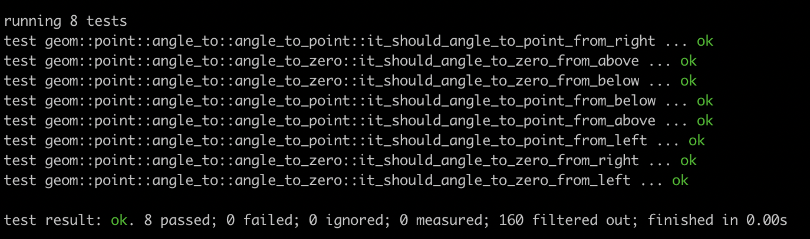

# TestCat

TestCat is a bunch of macros to make it easier to maintain your tests
in a more readable way. By making it possible to bunch test cases
together at the top of a file.

It is based on the JavaScript testing library Jest.

Macros include ...

 * `it` and `test`
 * `describe`

## Ethos

The aim is to aid in readability. To make it easier to manage long files
containing a large number of tests.

By having the test cases grouped together. It makes it easier to see,
at a glance, what test cases exist. This is especially useful for PR reviews.

### Full Example

In short it allows you to document your test cases like this ...

```rust
#[cfg(test)]
mod angle_to {
    use super::*;
    use ::testcat::*;
    use ::assert_approx_eq::assert_approx_eq;
    use ::std::f32::consts::TAU;

    describe!("angle to zero", {
        it!("should angle to zero from right", test_angle_to_zero_from_right);
        it!("should angle to zero from above", test_angle_to_zero_from_above);
        it!("should angle to zero from left", test_angle_to_zero_from_left);
        it!("should angle to zero from below", test_angle_to_zero_from_below);
    });

    describe!("angle to point", {
        it!("should angle to point from right", test_angle_to_point_from_right);
        it!("should angle to point from above", test_angle_to_point_from_above);
        it!("should angle to point from left", test_angle_to_point_from_left);
        it!("should angle to point from below", test_angle_to_point_from_below);
    });

    fn test_angle_to_zero_from_right() {
      // code omitted
    }

    // rest of test functions omitted
```

Running `cargo test` you get an output like this ...



## `it` and `test` macros

`it` and `test` are identical macros allow you to list test cases out together at the top.
These transform into a wrapper function, that calls your test.
The macro takes a description of the test, and the name of the function for that test.

There are two versions to help with readability. Their behaviour is identical.

 * `it` should be used when stating a desired outcome. i.e. `it!("should give the user a cookie", test_give_cookie)`.
 * `test` should be used for other types of more generic tests. i.e. `test!("cookie dispenser runs", test_cookie_dispenser)`.

### Example Code

```
#[cfg(test)]
mod testing {
  use ::testcat::*;

  it!("should allow the user to do x", test_user_does_x);
  it!("should not allow the user to do y", test_y_disallowed);
  test!("foobobulator doesn't crash", test_foobobulator);

  fn test_user_does_x() {
    // code omitted
  }

  fn test_y_disallowed() {
    // code omitted
  }

  fn test_foobobulator() {
    // code omitted
  }
}
```

### Module Names

You can also use a module paths for test names.

```
#[cfg(test)]
mod testing {
  use ::testcat::*;

  it!("should allow the user to do x", test_use::test_does_x);
  it!("should not allow the user to do y", test_use::test_y_disallowed);
  test!("foobobulator doesn't crash", test_foo::test_foobobulator);

  mod test_use {
    pub fn test_does_x() {
      // code omitted
    }

    pub fn test_y_disallowed() {
      // code omitted
    }
  }

  mod test_foo {
    pub fn test_foobobulator() {
      // code omitted
    }
  }
}
```

## `describe` macro

`describe` blocks are for grouping similar tests together.
These transform into a child module, where the tests are listed.

### Example Code

```
#[cfg(test)]
mod testing {
  use ::testcat::*;

  describe("user interaction", {
    it!("should allow the user to do x", test_user_does_x);
    it!("should not allow the user to do y", test_y_disallowed);
  })

  describe("timing", {
    it!("should do foo before bar", test_foo_over_bar);
  })

  fn test_user_does_x() {
    // code omitted
  }

  fn test_y_disallowed() {
    // code omitted
  }

  fn test_foo_over_bar() {
    // code omitted
  }
}
```

## Example 2

`describe` blocks can also contain functions. As the block is code for a child module.

```
#[cfg(test)]
mod testing {
  use ::testcat::*;

  describe("user interaction", {
    it!("should allow the user to do x", test_user_does_x);
    it!("should not allow the user to do y", test_y_disallowed);

    fn test_user_does_x() {
      // code omitted
    }

    fn test_y_disallowed() {
      // code omitted
    }
  })

  describe("timing", {
    it!("should do foo before bar", test_foo_over_bar);

    fn test_foo_over_bar() {
      // code omitted
    }
  })
}
```
